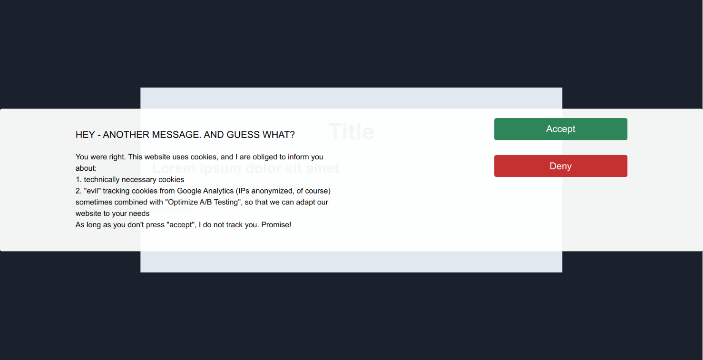

# React Cookie Popup

### Description

This React TypeScript Module allows to render a popup based on tailwindcss.



### Contribute

*Installation:*
```
git clone git@github.com:larsroettig/react-cookie-popup.git
yarn install
yarn start
```

*Execute Tests:*
```
git clone git@github.com:larsroettig/react-cookie-popup.git
yarn install
yarn test:watch
```
